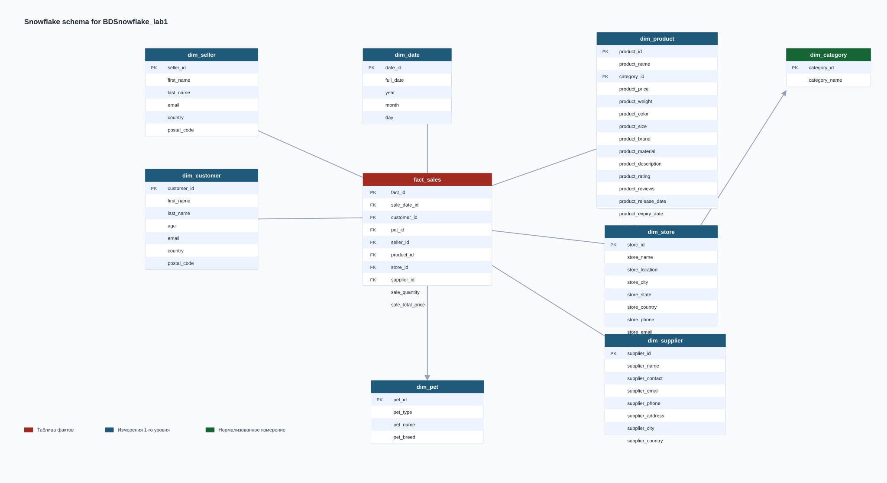

# Отчёт по лабораторной работе №1
**Тема:** Нормализация данных в схему «снежинка»  
**Дисциплина:** Анализ больших данных

Студент: Лизунов Кирилл Романович  
Группа: М80-315Б-23

---

## Что было сделано

В проекте используются 10 CSV-файлов с исходными данными:
`MOCK_DATA.csv`, `MOCK_DATA (1).csv`, ..., `MOCK_DATA (9).csv`.
Каждый файл содержит по 1000 строк, всего обрабатывается 10 000 записей.

Исходные данные описывают продажи и связанные сущности:
покупателей, продавцов, товары, магазины, поставщиков и питомцев покупателей.

Данные загружаются в промежуточную таблицу `mock_data`, после чего нормализуются
в аналитическую модель данных типа «снежинка».

---

## Структура проекта

```text
BDSnowflake_lab1/
├── docker-compose.yml
├── README.md
├── snowflake_schema.svg
├── sql/
│   ├── 01_init.sql
│   ├── 02_dims.sql
│   ├── 03_fact.sql
│   └── 04_check.sql
└── исходные данные/
    ├── MOCK_DATA.csv
    ├── MOCK_DATA (1).csv
    ├── ...
    └── MOCK_DATA (9).csv
```

---

## Схема данных



### Таблица фактов

**`fact_sales`** — одна строка на одну продажу.  
Хранит внешние ключи на измерения и числовые показатели продажи:

- `sale_date_id`
- `customer_id`
- `pet_id`
- `seller_id`
- `product_id`
- `store_id`
- `supplier_id`
- `sale_quantity`
- `sale_total_price`

### Таблицы измерений

| Таблица | Что хранит | Связи |
|---|---|---|
| `dim_date` | календарную дату продажи | используется в `fact_sales` |
| `dim_customer` | данные покупателя | используется в `fact_sales` |
| `dim_pet` | питомца покупателя | используется в `fact_sales` |
| `dim_seller` | данные продавца | используется в `fact_sales` |
| `dim_category` | категорию товара | используется в `dim_product` |
| `dim_product` | товар и его атрибуты | ссылается на `dim_category`, используется в `fact_sales` |
| `dim_store` | магазин | используется в `fact_sales` |
| `dim_supplier` | поставщика | используется в `fact_sales` |

Схема является snowflake schema, потому что одно из измерений нормализовано:
`fact_sales → dim_product → dim_category`.
Дополнительно отдельно вынесено измерение дат `dim_date`.

---

## SQL-скрипты проекта

### `01_init.sql`

Создаёт таблицы аналитической модели:

- таблицу фактов `fact_sales`
- измерения `dim_date`, `dim_customer`, `dim_pet`, `dim_seller`,
  `dim_category`, `dim_product`, `dim_store`, `dim_supplier`
- внешние ключи между фактами и измерениями
- связь `dim_product.category_id → dim_category.category_id`

### `02_dims.sql`

Заполняет таблицы измерений из промежуточной таблицы `mock_data`.

Скрипт:

- очищает таблицы перед повторной загрузкой
- формирует покупателей, продавцов, питомцев
- выделяет категории и товары
- загружает магазины и поставщиков
- формирует календарное измерение `dim_date`

### `03_fact.sql`

Заполняет таблицу `fact_sales`, связывая строки `mock_data`
с соответствующими записями измерений.

### `04_check.sql`

Содержит проверочные запросы:

- подсчёт количества строк в измерениях и фактах
- агрегаты по категориям товаров
- агрегаты по магазинам
- агрегаты по поставщикам
- выборки примеров данных из `fact_sales`, `dim_customer`, `dim_product`, `dim_date`

---

## Запуск

```bash
docker compose up -d
```

Контейнер поднимает PostgreSQL со следующими параметрами:

- `host=localhost`
- `port=5433`
- `db=lab_db`
- `user=postgres`
- `password=postgres`

После запуска необходимо:

1. Подключиться к PostgreSQL.
2. Предварительно загрузить исходные CSV-данные в таблицу `mock_data`.
3. Выполнить SQL-скрипты по порядку:

```text
sql/01_init.sql
sql/02_dims.sql
sql/03_fact.sql
sql/04_check.sql
```

Важно: в текущем проекте загрузка CSV в `mock_data` не автоматизирована через `docker-compose`,
поэтому staging-таблица и импорт данных выполняются отдельно.

---

## Итог

На основе 10 000 строк исходных данных построена нормализованная аналитическая модель.
Проект разделяет продажи на таблицу фактов и набор измерений, что позволяет анализировать данные
по времени, покупателям, продавцам, товарам, категориям, магазинам и поставщикам.
